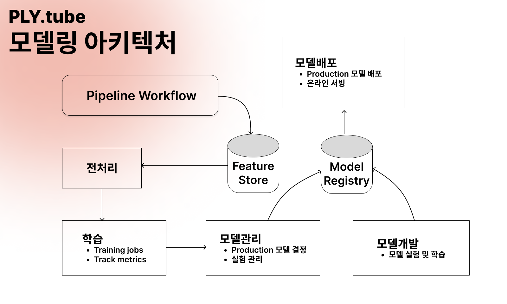

# Model

## 모델 소개

유튜브 플레이리스트 데이터를 기반으로, 가수-노래 데이터를 활용해 추천 시스템을 구축하는 프로젝트. 사용자 시청 기록 없이 플레이리스트 패턴을 학습해 관련된 노래를 추천함.

## 주요 단계

### 1. 영상 데이터 로드:

- 각 플레이리스트는 영상 ID, 영상 제목, 노래 목록으로 구성됨.
- 데이터는 JSON 형식 또는 구조화된 형식으로 로드.

### 2. 데이터 전처리:

- 노래 제목과 가수 정보를 추출해 일관된 포맷으로 정리.
- 같은 기호를 기준으로 가수와 노래 구분, 불필요한 문자 제거.

### 3. 데이터셋 구성:

- 전처리된 데이터를 기반으로 각 플레이리스트를 시퀀스 데이터로 변환.
- 학습에 적합한 형태로 플레이리스트 내 곡들의 순서를 유지하며 데이터 생성.
- 마지막 곡 다음에 이어질 곡을 예측하는 방식으로 학습 데이터와 라벨 구성.

### 4. LSTM 모델 학습:

- LSTM(Long Short Term Memory) 모델을 사용해 순차 데이터 학습.
- LSTM은 이전 곡의 정보를 기억하고 다음 곡을 예측하는 데 사용됨.

### 5. 평가 및 MLflow 로그:

- 모델 성능은 플레이리스트 내 곡의 예측 정확도로 평가.
- Precision, Recall, F1 Score 등의 평가 지표로 성능 측정 후 MLflow에 기록.
- MLflow로 학습 과정, 모델 파라미터, 평가 지표 등의 로그 저장 및 실험 추적 가능.

### 6.모델 업데이트:

- 새로 학습한 모델이 이전 운영 모델보다 성능이 좋을 경우 업데이트.
- 이전 모델과 성능을 비교해 지속적으로 모델 성능 개선 추구.

## Modeling Architecture

### 아키텍처 구조도



## 모델 로직

#### 1. 데이터 로드

```python
def load_data(file_path):
    # JSON 파일로부터 최신으로 업데이트된 데이터를 로드
    with open(file_path, 'r') as f:
        data = json.load(f)
    return data
```

#### 2. 데이터 전처리

- 노래 제목과 가수 분리
- 텍스트 정제 및 시퀀스 데이터 구성

```python
class LSTMdataset(Dataset):
    def __init__(self, playlists):
        self.BOM = {}
        self.playlists = playlists

        for playlist in self.playlists:
            for song in playlist:
                if song not in self.BOM.keys():
                    self.BOM[song] = len(self.BOM.keys())

        self.data = self.generate_sequence(self.playlists)

    def generate_sequence(self, playlists):
        seq = []

        for playlist in playlists:
            ply_bom = [self.BOM[song] for song in playlist]

            data = [([ply_bom[i], ply_bom[i+1], ply_bom[i+2]]) for i in range(len(ply_bom)-2)]

            seq.extend(data)
        return seq
```

#### 3. LSTM 모델 정의

```python
class LSTMModel(nn.Module):
    def __init__(self, num_embeddings):
        super(LSTMModel, self).__init__()

        self.embedding = nn.Embedding(num_embeddings=num_embeddings, embedding_dim=16)
        self.lstm = nn.LSTM(
                input_size=16,
                hidden_size=64,
                num_layers=5,
                batch_first=True)

        self.fc1 = nn.Linear(64, 128)
        self.fc2 = nn.Linear(128, num_embeddings)
        self.relu = nn.ReLU()

    def forward(self, x):
        x = self.embedding(x)

        x, _ = self.lstm(x)

        x = torch.reshape(x, (x.shape[0],-1))
        x = self.fc1(x)
        x = self.relu(x)
        x = self.fc2(x)
        return x
```

#### 4. 학습 및 평가

```python
def run_training(dataset, epochs=10, learning_rate=1e-3, batch_size=64):
    train_dataset, test_dataset, train_loader, test_loader = build_dataloaders(dataset, batch_size=batch_size)

    model = LSTMModel(num_embeddings=len(train_dataset.dataset.BOM))

    loss_fn = nn.CrossEntropyLoss()
    optimizer = optim.SGD(model.parameters(), lr=learning_rate)
    scheduler = lr_scheduler.StepLR(optimizer, step_size=epochs, gamma=0.1)

    best_acc = 0.0

    with mlflow.start_run() as run:
        mlflow.log_param("epochs", epochs)
        mlflow.log_param("learning_rate", learning_rate)
        mlflow.log_param("batch_size", batch_size)

        for epoch in range(epochs):
            print(f"Epoch {epoch+1}\n--------------------------")
            train_model(model, train_dataset, train_loader, loss_fn, optimizer)
            test_acc, test_loss, precision, recall, f1 = test_model(model, test_dataset, test_loader, loss_fn)

            # MLflow에 지표 로그
            mlflow.log_metric('Accuracy', test_acc, step=epoch)
            mlflow.log_metric('Loss', test_loss, step=epoch)
            mlflow.log_metric('Precision', precision, step=epoch)
            mlflow.log_metric('Recall', recall, step=epoch)
            mlflow.log_metric('F1Score', f1, step=epoch)

            if test_acc > best_acc:
                best_acc = test_acc
                print(f'new best accuracy : {best_acc}')
                mlflow.log_metric('best_acc', best_acc, step=epoch)
                input_tensor = torch.tensor(train_dataset[0][0]).unsqueeze(0).detach().cpu().numpy()
                model_output = model(torch.tensor(train_dataset[0][0]).unsqueeze(0)).detach().cpu().numpy()

                signature = infer_signature(input_tensor, model_output)
                mlflow.pytorch.log_model(model.cpu(), 'model', signature=signature)

            scheduler.step()

        input_tensor = torch.tensor(train_dataset[0][0]).unsqueeze(0).detach().cpu().numpy()
        model_output = model(torch.tensor(train_dataset[0][0]).unsqueeze(0)).detach().cpu().numpy()

        signature = infer_signature(input_tensor, model_output)
        mlflow.pytorch.log_model(model.cpu(), "model", signature=signature)

        model_uri = f"runs:/{run.info.run_id}/model"
        print(f"Model successfully logged at {model_uri}")

        model_name = "LSTMModel"
        try:
            mlflow.register_model(model_uri=model_uri, name=model_name)
            print(f"Model registered as '{model_name}' in model registry.")
        except MlflowException as e:
            print(f"Model registration failed: {e}")

        print("Done!")
        mlflow.end_run()
```

#### 5. 모델 성능 비교 및 운영 모델 변경

```python
from mlflow.tracking import MlflowClient

def production_alias(model_name, param):
    client = MlflowClient()
    versions = client.search_model_versions(f"name='{model_name}'")

    best_model_version = None

    current_production_version = None

    # 먼저 production alias가 이미 지정된 모델을 찾기 (tags 사용)
    for version in versions:
        if version.tags.get("stage") == "production":
            current_production_version = version.version
            run_id = version.run_id
            best_param = client.get_run(run_id).data.metrics.get(f'{param}')

    # 최고 성능의 모델 찾기
    for version in versions:
        run_id = version.run_id
        param_value = client.get_run(run_id).data.metrics.get(f'{param}')
        if param_value < best_param:
            best_param = param_value
            best_model_version = version.version

    # 이전 production alias를 삭제하고 새로 지정하기
    if best_model_version:
        # 기존 production alias가 있는 경우, 그 alias 삭제
        if current_production_version and current_production_version != best_model_version:
            client.delete_model_version_tag(
                name=model_name,
                version=current_production_version,
                key="stage"
            )
            print(f"Previous production alias removed from version {current_production_version}")

        # 새로 선택된 모델에 production alias 지정
        client.set_model_version_tag(
            name=model_name,
            version=best_model_version,
            key="stage",
            value="production"
        )
        print(f"Model version {best_model_version} with {param} = {best_param} set to 'production' alias.")
    else:
        print(f"Model version {current_production_version} with {param} = {best_param} set to 'production' alias")
```
